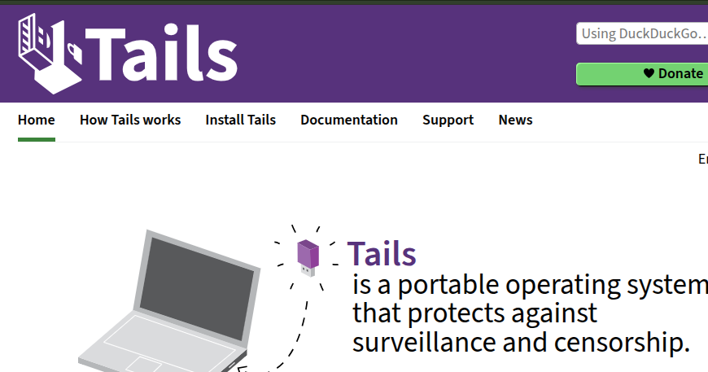
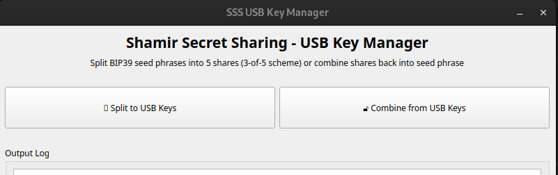

# 3 of 5 locking scheme for Bitcoin

Split your private key into 5 separate keyphrases using Shamir secret sharing (SSS). Any 3 keys will unlock the treasure.


## Step 1: Get your 5 USB keys


## Step 2: Setup and install Tails OS




## Step 3: Boot from Tails OS

Set up a persistent storage.


## Step 4: Install SSS

First, make sure to connect to the internet (TOR)

### Quick Install (One-liner)

```bash
curl -fsSL https://raw.githubusercontent.com/oyvinrog/sss/main/install.sh | bash
```

This will automatically:
- Clone the repository
- Install system dependencies (python3-venv, proxychains)
- Set up a Python virtual environment
- Install all required Python packages

---

## Step 5: Store your key on the USB pens

**After installation**, disconnect your internet connection, then start the GUI:

```bash
cd sss
source .venv/bin/activate
./run_gui
```

Enter your Bitcoin seed phrase. 

## Later: Recovery of key

1. Run `./run_gui` offline
2. Select 'Combine'
3. Select the USB drives with the shares
4. Validate the recovered key with Electrum (create new wallet with BIP39 seed phrase)


## Command Line Usage

Use `split.py` to split your Bitcoin private key into SSS shares

Use `combine.py` to combine back again

Use `generate_testphrase` if you want to generate a Bitcoin test seedphrase. This is useful if you want to verify that this utility works.


## Usage

### GUI Application (Recommended for USB Management)

The easiest way to manage SSS shares on USB drives is using the graphical interface:

```bash
./run_gui
# or
python3 sss_gui.py
```

The GUI provides:
- **Split to USB Keys**: Enter your seed phrase and write all 5 shares sequentially to USB drives
- **Combine from USB Keys**: Read shares from USB drives and recover your seed phrase





**Efficient USB Management:**
The application automatically detects USB drives with:

- Auto-refreshing list of available USB drives (updates every 2 seconds)
- Highlights newly inserted drives with a 🆕 NEW indicator
- Shows drive size and free space information
- One-click or double-click selection
- Manual browse option as fallback

The application will:
1. Guide you to insert each USB pen in sequence
2. Auto-detect and display available USB drives
3. Automatically create an `SSS_Shares` directory on each USB
4. Write share files with metadata and instructions
5. When restoring: automatically select the most recent share if multiple versions exist on a USB
6. Validate and combine shares when recovering

### Command Line Usage

### Splitting a BIP39 seed phrase

```bash
python3 split.py "prison supreme survey fetch drift wood book rose abstract input hammer this engage oil surprise behind poverty breeze profit ice regret whip monster hurt" shares.txt
```

This creates 5 shares in the file `shares.txt`. Any 3 of these shares can recover the original seed phrase.

### Combining shares back to original

If you want to reconstruct the original key, use **exactly 3 shares** from the file. You can manually select any 3 shares:

```bash
# Create a file with any 3 shares (for example, first 3 shares)
head -n 3 shares.txt > selected_shares.txt
python3 combine.py selected_shares.txt
```

**Note**: The combine script requires exactly 3 shares. If you pass a file with more than 3 shares, it will fail. This is by design for security and clarity.

Alternative: You can manually copy any 3 shares into a new file and combine those.

### Testing and Verification

Run comprehensive tests to verify the system works correctly:

```bash
# Quick test with 2 random phrases
./run_verification_tests 2

# Or run directly with Python
python3 test_bip39_verification.py 5
```

The test suite will:
- Generate random BIP39 phrases
- Split them into 5 shares  
- Verify any 3 random shares can recover the original
- Test all possible 3-share combinations
- Ensure fewer than 3 shares cannot recover the phrase

## Files

- `sss_gui.py` - PyQt5 GUI application for USB key management
- `run_gui` - Launcher script for the GUI application
- `split.py` - Split BIP39 phrase into Shamir shares
- `combine.py` - Combine Shamir shares back to BIP39 phrase  
- `bip39_utils.py` - Utility functions for word expansion
- `test_bip39_verification.py` - Comprehensive test suite
- `run_verification_tests` - Convenient test runner
- `generate_testphrase` - Generate random test BIP39 phrases
- `requirements.txt` - Python dependencies

## Security Notes

- This implements a 3-of-5 threshold scheme
- Any 3 shares can recover the original seed phrase
- 2 or fewer shares provide no information about the original
- Store shares in separate, secure locations
- Test the recovery process before relying on it